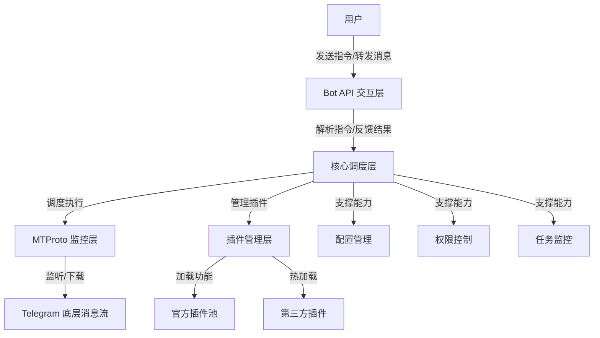

# Telegram-plugin-version-robot 🤖 (V1.0 暴力引擎版)
基于 Python + Telethon + python-telegram-bot 构建的**高自由度 Telegram 综合管理机器人**，核心采用「MTProto 底层监控层 + Bot API 上层指令交互层」解耦架构，突破纯 Bot API 功能限制，支持全量消息监控、高速媒体下载、插件化扩展，**必须完成 MTProto 登录解锁全部功能**。

---

## 📋 目录导航
- [🎯 项目核心定位](#-项目核心定位)
- [🏗️ 项目架构设计](#-项目架构设计)
- [📂 详细目录/文件说明](#-详细目录文件说明)
- [✨ 完整功能清单](#-完整功能清单)
- [📋 全量指令清单](#-全量指令清单)
- [🛠️ 部署指南](#-部署指南)
- [⚠️ 核心注意事项](#-核心注意事项)
- [📄 许可证](#-许可证)

---

## 🎯 项目核心定位
| 对比维度       | 纯 Bot API 机器人                | 本项目「MTProto+Bot API」架构          |
|----------------|----------------------------------|---------------------------------------|
| 消息监控范围   | 仅能监听 @ 机器人的指令消息      | 全量监听私聊/群组/频道的所有消息（文本/媒体/相册/转发） |
| 逻辑耦合度     | 指令与业务逻辑强绑定             | 指令交互与监控业务完全解耦，扩展灵活 |
| 底层控制力     | 受 API 接口限制（下载限速/功能阉割） | 直连 Telegram 底层协议，暴力下载/无功能限制 |
| 登录依赖       | 仅需 Bot Token                   | Session 持久化登录，免密复用 |

> 🚀 核心差异：**MTProto 作为监控层（负责底层操作），Bot API 作为交互层（负责指令收发）**，彻底释放 Telegram 机器人的底层能力。

---

## 🏗️ 项目架构设计
### 1. 架构分层图


### 2. 分层职责说明
| 层级           | 核心职责                                                                 |
|----------------|--------------------------------------------------------------------------|
| **Bot API 交互层** | 仅处理：用户指令接收（如 `/dl`）、执行结果反馈（如下载进度）、可视化看板推送 |
| **核心调度层**     | 中间枢纽：解析指令 → 调度 MTProto 执行 → 管理任务生命周期 → 反馈结果       |
| **MTProto 监控层** | 底层核心：全量消息监听、媒体高速下载、频道/群组内容搜刮、Session 管理       |
| **插件管理层**     | 插件生命周期管理：加载、热更新、禁用、帮助文档自动聚合                     |
| **基础支撑层**     | 通用能力：配置读取、权限校验、任务监控、日志记录                           |

---

## 📂 详细目录/文件说明
### 核心目录结构
```
Telegram-plugin-version-robot/
├── core/               # 核心驱动层（架构核心）
├── features/           # 官方插件目录（所有功能模块化）
├── sessions/           # MTProto 会话存储（登录凭证）
├── download/           # 下载文件存储（自动分目录）
├── plugins/            # 第三方插件目录（热安装）
├── main.py             # 唯一启动入口
├── requirements.txt    # 依赖清单（版本锁定）
├── Dockerfile          # 容器构建文件
└── docker-compose.yml  # 容器编排文件
```

### 关键文件职责（表格优化版）
| 目录/文件                | 层级         | 核心作用                                                                 | 关键细节                                                                 |
|--------------------------|--------------|--------------------------------------------------------------------------|--------------------------------------------------------------------------|
| `core/config_manager.py` | 基础支撑层   | 全局配置中心                                                             | 加载 `.env`/配置文件，管理 Token/API ID/路径/权限等参数                   |
| `core/client_manager.py` | 核心调度层   | 客户端生命周期管理                                                       | 初始化 Bot API/MTProto 客户端，处理登录/重连/启停                         |
| `core/plugin_scanner.py` | 插件管理层   | 插件扫描与注册                                                           | 自动扫描 `features/` 插件，支持热加载/重载                               |
| `core/utils.py`          | 基础支撑层   | 通用工具函数                                                             | 权限校验、路径处理、日志封装、字符串处理                                 |
| `features/basic/`        | 官方插件层   | 基础指令插件                                                             | 实现 `/start`/`/help`/`/status` 等通用指令                               |
| `features/downloader/`   | 官方插件层   | 核心下载插件                                                             | 实现 `/dl`/`/dl_all`/`/dl_stop` 等下载相关指令                            |
| `features/mtproto/`      | 官方插件层   | MTProto 登录插件                                                         | 实现 `/mtlogin` 指令，处理手机号验证/Session 持久化                       |
| `features/admin/`        | 官方插件层   | 管理员功能插件                                                           | 实现 `/add_admin`/`/plugins`/`/python` 等管理指令                        |
| `sessions/openbot.session` | 数据存储层 | MTProto 登录凭证                                                         | 持久化登录状态，删除后需重新登录                                         |
| `download/`              | 数据存储层   | 下载文件存储                                                             | 按「源ID/频道名」自动分目录，支持断点续传                                 |

---

## ✨ 完整功能清单
### 1. 核心基础能力（必看）
| 功能模块       | 具体能力                                                                 | 优势亮点                                                                 |
|----------------|--------------------------------------------------------------------------|--------------------------------------------------------------------------|
| 📡 消息监控     | 全量监听私聊/群组/频道的文本、媒体、相册、转发消息                        | 突破 Bot API 限制，无需 @ 机器人即可捕获消息                               |
| 🔐 账号管理     | MTProto Session 持久化登录、自动重连、多账号切换（扩展）                  | 免重复登录，会话文件加密存储                                             |
| 🛡️ 权限控制     | 超级管理员/普通管理员分级、指令权限过滤、白名单（扩展）                   | 精细化管控，防止功能滥用                                                 |
| 📊 可视化监控   | 实时任务看板、下载进度滚动更新、磁盘占用监控                             | HTML 格式化展示，直观清晰                                                 |

### 2. 下载核心能力（核心卖点）
| 功能项                 | 具体说明                                                                 | 使用场景                     |
|------------------------|--------------------------------------------------------------------------|------------------------------|
| ⚡ 暴力秒下引擎         | 直连 MTProto 协议，下载速度远超 Bot API                                  | 批量下载大文件/高清视频       |
| 📥 自动转发下载         | 转发媒体消息给机器人，自动触发批量下载                                   | 群组/频道内容快速归档         |
| 🔍 频道内容搜刮         | 指定频道 ID，自动遍历并下载所有媒体（支持关键词过滤）                     | 频道内容批量备份             |
| 📷 Album 相册识别       | 自动识别 Telegram 相册消息，完整下载整套媒体（无遗漏）                   | 相册类内容下载               |
| ⏭️ 断点续传             | 大文件下载中断后，重新启动可从断点继续                                   | 大视频/大文件下载            |
| 🎯 下载过滤             | 按文件类型（图片/视频/文档）、大小、关键词过滤                           | 精准获取目标文件             |

### 3. 插件化扩展能力（高自由度）
| 功能项                 | 具体说明                                                                 | 操作方式                     |
|------------------------|--------------------------------------------------------------------------|------------------------------|
| 🔌 插件热安装           | 通过 `/add_plugin` 指令上传 `.py` 文件，无需重启即可加载新功能             | 在线扩展，无需停机           |
| 🔄 插件重载             | 通过 `/reload_plugins` 指令，实时同步插件代码修改                         | 开发调试高效                 |
| 📋 插件管理             | 查看已加载插件列表、禁用/启用插件                                         | `/plugins`/`/disable_plugin` |
| 📝 自动帮助文档         | 插件内置 `help.txt`，通过 `/help` 自动聚合所有功能说明                   | 无需手动维护文档             |

### 4. 管理员高级能力（运维必备）
| 功能项                 | 具体说明                                                                 | 操作方式                     |
|------------------------|--------------------------------------------------------------------------|------------------------------|
| 🐍 远程 Python 执行     | 通过 `/python` 指令执行 Python 代码/安装依赖                              | 远程运维，无需登录服务器     |
| 💾 磁盘监控             | 查看指定路径磁盘占用，设置阈值提醒                                       | `/disk`/`/disk /data`        |
| 📊 系统状态查询         | 查看 Python 版本、Bot/MTProto 状态、系统信息                             | `/status`                    |
| 🔧 插件热部署           | 无需重启机器人，快速更新功能模块                                         | `/add_plugin` + 插件文件     |

---

## 📋 全量指令清单（带使用示例）
### 一、基础指令（所有用户可访问）
| 指令          | 权限要求 | 功能说明                                                                 | 使用示例                                  |
|---------------|----------|--------------------------------------------------------------------------|-------------------------------------------|
| `/start`      | 所有用户 | 启动机器人，返回欢迎语及核心指引                                         | `/start`                                  |
| `/help`       | 所有用户 | 自动聚合所有插件帮助文档，展示全量指令                                   | `/help`                                   |
| `/id`         | 所有用户 | 查看当前聊天 ID，支持解析远程频道/用户 ID                                 | `/id` 或 `/id https://t.me/xxx`            |
| `/version`    | 所有用户 | 查看机器人版本及核心依赖版本                                             | `/version`                                |

### 二、MTProto 相关指令
| 指令          | 权限要求 | 功能说明                                                                 | 使用示例                                  |
|---------------|----------|--------------------------------------------------------------------------|-------------------------------------------|
| `/mtlogin`    | 管理员   | 触发 MTProto 登录/重新登录（更换账号时使用）                              | `/mtlogin`                                |
| `/mtstatus`   | 管理员   | 查看 MTProto 连接状态、登录账号信息                                       | `/mtstatus`                               |

### 三、下载相关指令（核心功能）
| 指令          | 权限要求 | 功能说明                                                                 | 使用示例                                  |
|---------------|----------|--------------------------------------------------------------------------|-------------------------------------------|
| `/dl`         | 管理员   | 手动下载：指定频道/链接，支持关键词过滤                                   | `/dl https://t.me/xxx all` 或 `/dl -100xxx 关键词` |
| `/dl_all`     | 管理员   | 监控下载：持续监控指定频道，自动同步新媒体                               | `/dl_all -100xxx all`                     |
| `/dls`        | 管理员   | 查看所有活跃下载/监控任务                                               | `/dls`                                    |
| `/dl_stop`    | 管理员   | 暂停指定任务（无参数暂停所有）                                           | `/dl_stop 1` 或 `/dl_stop`                |
| `/dl_continue`| 管理员   | 恢复指定暂停任务                                                         | `/dl_continue 1`                          |
| `/dl_no`      | 管理员   | 取消指定任务并清理进度                                                   | `/dl_no 1`                                |

### 四、插件管理指令
| 指令          | 权限要求 | 功能说明                                                                 | 使用示例                                  |
|---------------|----------|--------------------------------------------------------------------------|-------------------------------------------|
| `/plugins`    | 管理员   | 查看已加载插件列表及状态                                                 | `/plugins`                                |
| `/add_plugin` | 超级管理员 | 进入热安装模式，发送 `.py` 文件即可部署新插件                             | `/add_plugin` + 插件文件                   |
| `/reload_plugins` | 超级管理员 | 重载所有插件，同步代码修改                                             | `/reload_plugins`                         |
| `/disable_plugin` | 超级管理员 | 禁用指定插件                                                           | `/disable_plugin downloader`              |

### 五、管理员运维指令
| 指令          | 权限要求 | 功能说明                                                                 | 使用示例                                  |
|---------------|----------|--------------------------------------------------------------------------|-------------------------------------------|
| `/status`     | 管理员   | 查看系统运行状态（Bot/MTProto/磁盘/任务）                                | `/status`                                 |
| `/disk`       | 管理员   | 查看磁盘占用，支持指定路径                                               | `/disk` 或 `/disk D:/download`            |
| `/python`     | 超级管理员 | 远程执行 Python 指令/安装依赖                                            | `/python pip install requests`            |
| `/groupinfo`  | 管理员   | 查看群组/频道深度信息（成员数/在线人数）                                 | `/groupinfo`（需在目标群组发送）           |
| `/add_admin`  | 超级管理员 | 添加普通管理员                                                           | `/add_admin 123456789`                    |

---

## 🛠️ 部署指南
### 1. 环境准备（必做）
| 依赖项                | 要求/获取方式                                                             |
|-----------------------|--------------------------------------------------------------------------|
| Python                | 3.11+（推荐 3.11.0，避免 3.12+ 兼容问题）                                |
| Bot Token             | 从 [@BotFather](https://t.me/BotFather) 获取（发送 `/newbot` 按指引操作） |
| API ID/Hash           | 从 [my.telegram.org](https://my.telegram.org) 申请（需登录 Telegram）     |
| 管理员 ID             | 从 [@userinfobot](https://t.me/userinfobot) 获取（发送任意消息）          |

### 2. 原生部署步骤（适合开发/测试）
```bash
# 1. 克隆项目
git clone <你的GitHub仓库地址> Telegram-plugin-version-robot
cd Telegram-plugin-version-robot

# 2. 安装依赖
pip install -r requirements.txt

# 3. 配置 .env 文件（复制示例并修改）
cp .env.example .env
# 编辑 .env 文件，填入 BOT_TOKEN/API_ID/API_HASH/ADMIN_ID

# 4. 启动机器人
python main.py

# 5. 完成 MTProto 登录（终端按提示输入手机号→验证码→两步验证密码）
```

### 3. Docker 部署步骤（推荐生产环境）
```bash
# 1. 构建镜像
docker-compose build

# 2. 启动容器（持久化数据，自动重启）
docker-compose up -d

# 3. 查看日志（确认启动状态）
docker-compose logs -f

# 4. 若未自动触发登录，进入容器手动登录
docker exec -it telegram-robot python main.py
```

> 📌 容器部署优势：无需配置本地 Python 环境，数据持久化（下载文件/会话/日志不会丢失），崩溃自动重启。

---

Telegram-plugin-version-robot/
├── .env.example               # 配置文件示例（复制为.env后修改）：存储Bot Token/API ID等核心参数
├── .gitattributes             # Git 属性配置：指定文件编码、换行符等
├── .gitignore                 # Git 忽略文件：指定无需提交的文件（如.env、日志、会话文件）
├── docker-compose.yml         # Docker 容器编排文件：一键部署、数据持久化、自动重启配置
├── Dockerfile                 # Docker 镜像构建文件：定义Python环境、依赖安装、启动命令
├── main.py                    # 项目唯一启动入口：初始化核心模块、启动Bot/MTProto客户端
├── README.md                  # 项目说明文档：部署指南、功能清单、使用教程
├── requirements.txt           # 依赖清单（版本锁定）：列出所有必需的Python库及兼容版本
├── bootstrap/                 # 启动器模块：负责项目初始化流程
│   ├── launcher.py            # 核心启动逻辑：加载配置、初始化客户端、启动插件扫描
│   └── __init__.py            # 模块标识文件：使bootstrap成为Python包
├── core/                      # 核心驱动层：框架核心逻辑（配置、客户端、插件、工具等）
│   ├── client_manager.py      # 客户端生命周期管理：初始化Bot API/MTProto客户端、处理启停/重连
│   ├── command_registry.py    # 指令注册中心：统一管理所有插件的指令处理器（避免冲突）
│   ├── config_manager.py      # 配置管理：读取.env文件、提供全局配置访问接口、配置持久化
│   ├── exceptions.py          # 自定义异常类：定义项目专属异常（如配置缺失、登录失败）
│   ├── logger.py              # 日志系统：配置日志格式、分级输出、插件日志分流（按模块存储）
│   ├── mtproto_client.py      # MTProto客户端封装：直连Telegram底层协议、登录/下载/监听实现
│   ├── plugin_scanner.py      # 插件扫描器：自动扫描features/目录、热加载插件、语法校验
│   ├── utils.py               # 通用工具函数：权限校验、手机号格式验证、字符串脱敏、路径处理
│   ├── validator.py           # 配置校验：验证.env文件中核心参数（如API ID格式、Bot Token有效性）
│   └── __init__.py            # 模块标识文件：使core成为Python包，导出核心类
├── features/                  # 官方插件目录：所有功能以插件形式模块化实现（解耦业务逻辑）
│   ├── __init__.py            # 模块标识文件：使features成为Python包
│   ├── admin/                 # 管理员功能插件：仅管理员可使用的高级功能
│   │   ├── admin_manager.py   # 管理员权限管理：添加/查看管理员（/add_admin、/admins）
│   │   ├── help.txt           # 插件帮助文档：自动被/help指令聚合
│   │   ├── help_manager.py    # 开发手册插件：生成插件开发模板（/cj指令）
│   │   ├── plugin_manager.py  # 插件管理功能：热安装/重载/查看插件（/add_plugin、/plugins）
│   │   └── __init__.py        # 插件模块标识：注册admin插件组
│   ├── basic/                 # 基础指令插件：所有用户可使用的通用指令
│   │   ├── basic_manager.py   # 基础功能实现：/start、/ping、/id、/status、/disk、/python
│   │   ├── help.txt           # 插件帮助文档：自动被/help指令聚合
│   │   └── __init__.py        # 插件模块标识：注册basic插件组
│   ├── downloader/            # 下载核心插件：MTProto暴力下载功能
│   │   ├── at_downloader.py   # 自动转发下载：监听转发媒体，批量自动下载（无需指令）
│   │   ├── help.txt           # 插件帮助文档：自动被/help指令聚合
│   │   ├── mt_downloader.py   # 手动/监控下载：/dl、/dl_all、/dls等指令实现，支持频道搜刮
│   │   └── __init__.py        # 插件模块标识：注册downloader插件组
│   ├── forwarder/             # 超级转发器插件：监控源群，定时清洗转发到目标群
│   │   ├── forward_manager.py # 转发功能实现：/fw_src、/fw_dst、/fw_task等指令
│   │   ├── help.txt           # 插件帮助文档：自动被/help指令聚合
│   │   └── __init__.py        # 插件模块标识：注册forwarder插件组
│   ├── help_auto/             # 自动帮助插件：聚合所有插件的help.txt生成统一/help菜单
│   │   ├── help.txt           # 插件帮助文档：自动被/help指令聚合
│   │   ├── help_manager.py    # 帮助功能实现：/help指令核心逻辑，扫描所有help.txt
│   │   └── __init__.py        # 插件模块标识：注册help_auto插件组
│   ├── mtproto/               # MTProto登录插件：处理MTProto账号登录
│   │   ├── help.txt           # 插件帮助文档：自动被/help指令聚合
│   │   ├── login_manager.py   # 登录功能实现：/mtlogin指令，处理手机号/验证码/两步验证
│   │   └── __init__.py        # 插件模块标识：注册mtproto插件组
│   └── promo/                 # 智能推广插件：监控群组消息，按规则自动推广素材
│       ├── help.txt           # 插件帮助文档：自动被/help指令聚合
│       ├── smart_promo.py     # 推广功能实现：/tg_save、/tg_push、/tg_task_list等指令
│       └── __init__.py        # 插件模块标识：注册promo插件组
├── download/                  # 下载文件存储目录：按「源ID/频道名」自动分目录，默认存储路径
│   └── download_tasks.db      # 下载任务数据库：记录下载任务状态、断点续传信息
├── logs/                      # 日志存储目录：分模块存储日志，便于问题排查
│   ├── openbot_main.log       # 主日志文件：记录核心框架运行日志（如启动/停止/全局错误）
│   └── plugins/               # 插件日志目录：按插件模块分日志文件（如admin/、downloader/）
├── sessions/                  # MTProto会话存储目录：持久化登录凭证
│   └── openbot.session        # MTProto会话文件：登录成功后生成，删除需重新登录
├── 推广数据/                  # 智能推广插件数据目录：存储素材库、模式库、任务配置（JSON文件）
└── 转发数据/                  # 超级转发器插件数据目录：存储转发规则、待发缓存
    └── temp_media/            # 转发临时媒体目录：缓存转发过程中的媒体文件

## ⚠️ 核心注意事项
### 1. 安全防护
- **会话文件保护**：`sessions/` 目录下的 `.session` 文件是登录凭证，泄露会导致账号被盗，建议设置权限 `chmod 600 sessions/*`（Linux）；
- **权限控制**：生产环境务必启用白名单或管理员权限，避免陌生人滥用下载/运维功能；
- **依赖安全**：定期更新依赖（`pip install -r requirements.txt --upgrade`），修复已知漏洞。

### 2. 规避 Telegram 限制
- 下载线程数建议 5-10，过高易触发限流；
- 单机器人监控频道/群组≤20个，避免短时间内大量请求；
- 批量下载时，建议通过 `/dl` 而非 `/dl_all` 分批次执行，减少触发风控的概率。

### 3. 运维建议
- **磁盘管理**：定期清理 `download/` 目录下的无用文件，避免磁盘占满；
- **日志查看**：`logs/` 目录下有分模块日志，排查问题时优先查看对应插件日志；
- **重启策略**：修改核心代码后需重启机器人，插件热更新无需重启；
- **版本更新**：拉取最新代码后，Docker 部署需重新构建镜像（`docker-compose down && docker-compose up -d --build`）。

---

## 📄 许可证
[MIT License](LICENSE)

本项目开源免费，可自由使用、修改、分发，商用需保留原作者版权声明。

---

## 📞 问题反馈
若遇到 Bug 或有功能建议，可通过以下方式反馈：
1. GitHub 仓库提交 Issue；
2. 联系管理员（配置文件中 `ADMIN_ID` 对应的 Telegram 账号）。

> 🚀 祝使用愉快！如果觉得项目好用，欢迎给 GitHub 仓库点个 Star ⭐～
